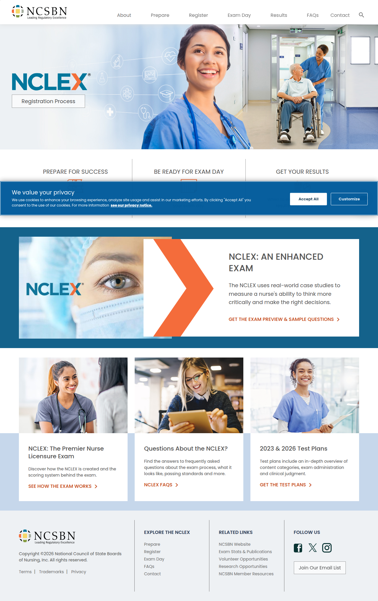

# Visited: https://www.nclex.com/
**Time:** Fri May  8 08:59:03 UTC 2026

## Screenshot

## Raw HTML
[page.html](./page.html)

## Downloaded Media (0 files)
_No media files downloaded_

## Other Links
- [#main-content](#main-content)
- [../stay-informed.page](../stay-informed.page)
- [//vjs.zencdn.net/6.6.0/video-js.min.css](//vjs.zencdn.net/6.6.0/video-js.min.css)
- [//vjs.zencdn.net/6.6.0/video.min.js](//vjs.zencdn.net/6.6.0/video.min.js)
- [/About.page](/About.page)
- [/acceptable-id.page](/acceptable-id.page)
- [/candidate-performance-report.page](/candidate-performance-report.page)
- [/clinical-judgment-measurement-model.page](/clinical-judgment-measurement-model.page)
- [/computerized-adaptive-testing.page](/computerized-adaptive-testing.page)
- [/css/nclex-base.css](/css/nclex-base.css)
- [/exam-day.page](/exam-day.page)
- [/faqs.page](/faqs.page)
- [/fees-payment.page](/fees-payment.page)
- [/images/manifest.json](/images/manifest.json)
- [/iwov-resources/ui-frameworks/custom/ncsbn-microsite-grid.css](/iwov-resources/ui-frameworks/custom/ncsbn-microsite-grid.css)
- [/js/modernizr.js](/js/modernizr.js)
- [/js/nclex.min.js](/js/nclex.min.js)
- [/nclex-online.page](/nclex-online.page)
- [/nclex-rules.page](/nclex-rules.page)
- [/next-generation-nclex.page](/next-generation-nclex.page)
- [/passing-standard.page](/passing-standard.page)
- [/prepare.page](/prepare.page)
- [/quick-results.page](/quick-results.page)
- [/register.page](/register.page)
- [/registration.page](/registration.page)
- [/results.page](/results.page)
- [/scheduling.page](/scheduling.page)
- [/test-plans.page](/test-plans.page)
- [/testing-locations.page](/testing-locations.page)
- [http://www.twitter.com/NCLEXInfo](http://www.twitter.com/NCLEXInfo)
- [https://ajax.googleapis.com/ajax/libs/jquery/3.4.1/jquery.min.js](https://ajax.googleapis.com/ajax/libs/jquery/3.4.1/jquery.min.js)
- [https://cdn.jsdelivr.net/npm/cookieconsent@3/build/cookieconsent.min.css](https://cdn.jsdelivr.net/npm/cookieconsent@3/build/cookieconsent.min.css)
- [https://fonts.googleapis.com/css?family=Libre+Franklin:300,600](https://fonts.googleapis.com/css?family=Libre+Franklin:300,600)
- [https://policies.ncsbn.org/privacy.page](https://policies.ncsbn.org/privacy.page)
- [https://policies.ncsbn.org/terms-of-use.page](https://policies.ncsbn.org/terms-of-use.page)
- [https://policies.ncsbn.org/terms-of-use.page#7](https://policies.ncsbn.org/terms-of-use.page#7)
- [https://static.zdassets.com/ekr/snippet.js?key=abd46cea-3000-4a5f-b49a-313c288caae4](https://static.zdassets.com/ekr/snippet.js?key=abd46cea-3000-4a5f-b49a-313c288caae4)
- [https://www.facebook.com/NCSBNNCLEX](https://www.facebook.com/NCSBNNCLEX)
- [https://www.googletagmanager.com/gtag/js?id=AW-779045358](https://www.googletagmanager.com/gtag/js?id=AW-779045358)
- [https://www.googletagmanager.com/ns.html?id=GTM-5B47QXW](https://www.googletagmanager.com/ns.html?id=GTM-5B47QXW)
- [https://www.instagram.com/nclexinfo/](https://www.instagram.com/nclexinfo/)
- [https://www.ncsbn.org](https://www.ncsbn.org)
- [https://www.ncsbn.org/](https://www.ncsbn.org/)
- [https://www.ncsbn.org/exam-contacts.htm](https://www.ncsbn.org/exam-contacts.htm)
- [https://www.ncsbn.org/exams/exam-member-resources.page](https://www.ncsbn.org/exams/exam-member-resources.page)
- [https://www.ncsbn.org/exams/exam-statistics-and-publications.page](https://www.ncsbn.org/exams/exam-statistics-and-publications.page)
- [https://www.ncsbn.org/exams/exam-volunteer-opportunities.page](https://www.ncsbn.org/exams/exam-volunteer-opportunities.page)
- [https://www.ncsbn.org/exams/nclex-research-opportunities.page](https://www.ncsbn.org/exams/nclex-research-opportunities.page)

## Stats
- Links: 65
- Media: 0
